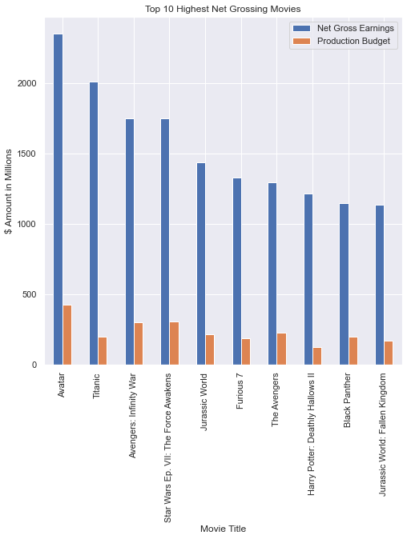
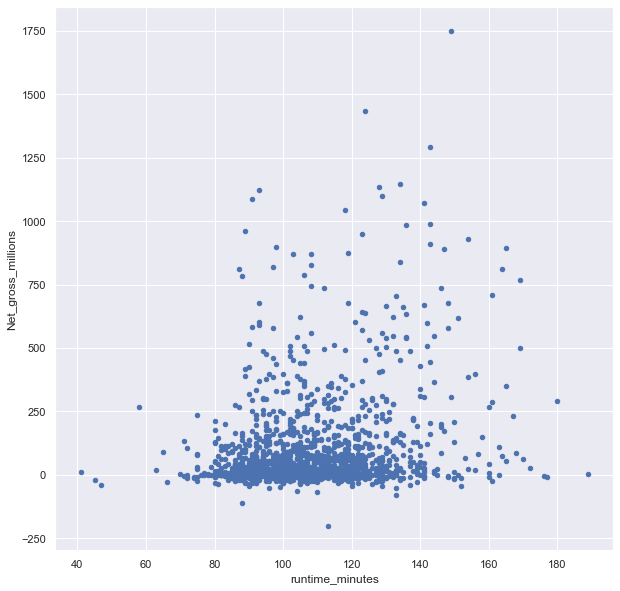
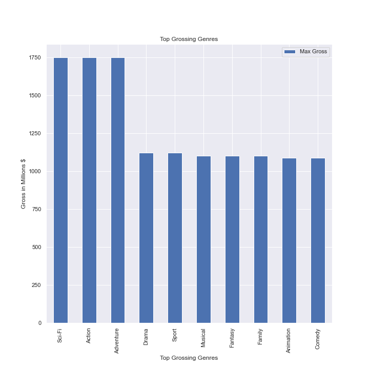

# Microsoft Movie Analysis

 

#### Project by: Lucas Wilkerson
#### Date: 6/2/2023

## Project Overview

This project uses exploratory data analysis to analyze characteristics and factors of movies that are correlated to success at the box office to generate insights and recommendations for the stakeholder. Descriptive analysis of budget, gross earnings, genre and run time will be explored to see how these are related to movie success and return on investment (Measured by Net Gross Earnings). Microsoft stakeholders can use this analyis to decide what type of films to create and what budgets to plan for.

### Business Problem

Microsoft sees all the big companies creating original video content and they want to get in on the fun. They have decided to create a new movie studio, but they don’t know anything about creating movies. I will be exploring what types of films are currently doing the best at the box office and translate those findings into actionable insights that the head of Microsoft's new movie studio can use to help decide what type of films to create.

### The Data

The movie datasets included for this analysis are from the Box Mojo, IMDB and The Numbers: 

* [The Numbers](https://www.the-numbers.com/)
* [IMDB](https://www.imdb.com/)
* [Box Office Mojo](https://www.boxofficemojo.com/)

The Numbers Budget dataset contains 5782 records with 6 columns that include information on id, release date, movie (the movie title), production budget domesticgross, and worldwide gross. Upon cleaning the dataset by removing any null values and adding a new column for total net gross earnings (worldwide gross - production budget), the dataset now contains 5234 rows. 

 

When looking at the distribution of films by total net gross, we can see that the distribution is positively skewed. A majority of the films fall between 0 and 200 million dollars for total net gross earnings. Using descriptive analysis we find that the mean for total net gross earnings is roughly 66.7 million dollars and the median is 13.6 million dollars. 

The IMDB dataset contain numerous entries with multiple tables to pull data from. I ran a query to pull data that included the columns title, is orginal title, runtime minutes, genres and movie id. I set original_title to one because I wanted to return movies that had their original title and then grouped but movie id and genre. This yielded 36857 entries. I then merged this dataset with the cleaned Numbers Budget dataset and dropped any null values to obtain a clean dataset of 1619 entries containing the information on budget, gross, runtime minutes and genre needed for analysis. 

The Box Office Mojo dataset consisted of 3387 entries with columns including information on title, studio, domestic gross, foreign gross and year. Ultimately this data set was not utilized as it did not contain any budget information needed to calculate total net gross earnings. 

The IMDB dataset 

### Methods

This project uses descriptive analysis, including explorations correlations between movie budget, run time and genre on total net gross earnings of the film. This provides a useful insight into characteristics of making a successful film to identify recommendations for what Microsoft should consider when producing a film.

### Results/Insights 

- There is a correlation between production budget and total overall net gross earnings in which higher budget movies tend to yield higher total net gross earnings. 

 

- The movie's run time has less of an effect on total net gross earnings. The overall average run time was 107 minutes but when looking at both the top 20 and top 100 highest net grossing films run time averaged between 120-130 minutes. 

 

- The average top net grossing genres are Animation, Adventure, and Sci-Fi, however the genres that produced the highest max net gross were Sci-Fi, Action, and Adventure. 

 

 

### Conclusion/Recommendations for Microsoft

- When planning the budget, Microsoft should plan for a budget of 160 million for production of their films in order to maximize potential for high net gross earnings. 
- While run times did vary, Microsoft should plan to produce films with a run time between 120-130 minutes. 
- Microsoft should produce movies with the genres of Animation, Adventure, and Sci-Fi. 

### Repository Structure
├── Draft_project_materials
├── Images
├── zippedData
├── Microsoft_Analysis.ipynb
├── Microsoft_Movie_Analysis_Presentation_Slides .pdf
├── README.md
└── README_draft.md
